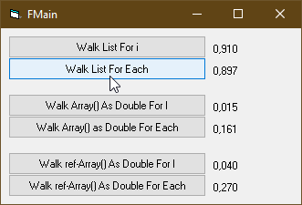

# ActX_Threading  
## Small vb-project shows how to do threading in VB with an activeX-exe  

 

Project started in nov 2022.  
This example shows how to implement the threading capabilities of VBC in an ActiveX-exe.  
The sample code uses sockets to gain the name behind an local IP-address.
Starting 100 threads at once, makes the code run 100 times faster.

[Link text Here](https://link-url-here.org) 

