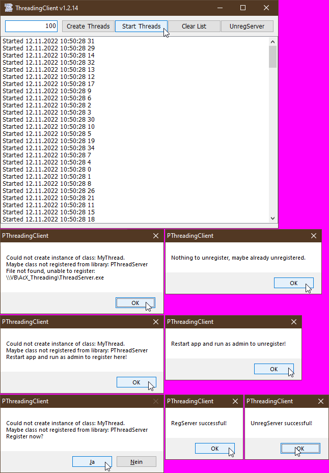

# AcX_Threading  
## Project shows how to do async multithreading in VB with an activex-exe  

 

Project started in nov 2022.  
This example shows how to implement the threading capabilities of VBC in an ActiveX-exe. The sample code uses windows sockets to gain the name from a local IP-address.  
Starting 100 threads at once, makes the code run 100 times faster than calling it in sync. The thread-server can be registered and unregistered in the app, nothing to do manually.  

